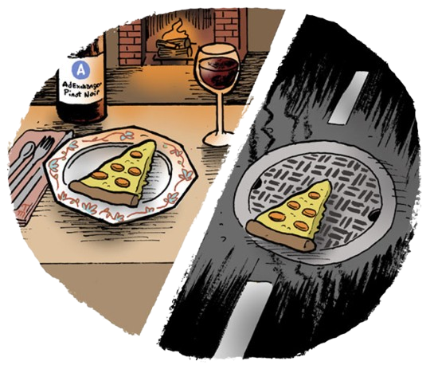

<div align="center">
<h1 style="font-size: 50px">Context Matters!</h1> 

<h2>Relaxing Goals with LLMs for Feasible 3D Scene Planning</h2>

<a href="https://scholar.google.com/citations?user=XLcFkmUAAAAJ&hl=it&oi=ao">Emanuele Musumeci</a><sup><span>1,*</span></sup>,
<a href="https://scholar.google.com/citations?user=sk3SpmUAAAAJ&hl=it&oi=ao">Michele Brienza</a><sup><span>1,*</span></sup>,
<a href="https://scholar.google.com/citations?user=Y8LuLfoAAAAJ&hl=it&oi=ao">Vincenzo Suriani</a><sup><span>2</span></sup>,
<a href="https://www.linkedin.com/in/fra-arg/">Francesco Argenziano</a><sup><span>1</span></sup>,
<a href="https://scholar.google.com/citations?user=xZwripcAAAAJ&hl=it&oi=ao">Daniele Nardi</a><sup><span>1</span></sup>,
<a href="https://scholar.google.com/citations?user=_90LQXQAAAAJ&hl=it&oi=ao">Domenico D. Bloisi</a><sup><span>3</span></sup>
</br>

<sup>1</sup> Department of Computer, Control and Management Engineering, Sapienza University of Rome, Rome, Italy, <br>
<sup>2</sup> School of Engineering, University of Basilicata, Potenza, Italy, <br>
<sup>3</sup> International University of Rome UNINT, Rome, Italy <br>
<sup>*</sup> First Co-Authors
<div>

[](https://lab-rococo-sapienza.github.io/context-matters/)
[](https://lab-rococo-sapienza.github.io/contetx-matters/)
[](LICENSE)


</div>
<h5>Image credits to: https://www.adexchanger.com/comic-strip/adexchanger-context-matters/</h5>
</div>

# Install

1. Clone this repo
```
git clone --recurse-submodules https://github.com/Lab-RoCoCo-Sapienza/context-matters.git
```

2. Setup a virtual environment (conda, venv, ...) and install the requirements.txt

```
pip install -r requirements.txt
```
   
3. Install the pddlgym_planners submodule
```
cd third-party/pddlgym_planners/
pip install -e
```
   
4. Install ollama
```
sudo snap install ollama
```

5. Build VAL
```
bash third-party/VAL/scripts/linux/build_linux64.sh build Release
cd third-party/VAL/build/linux64/Release
make
```
# Generate dataset
1. Download the original data from the original [3DSG repo](https://github.com/StanfordVL/3DSceneGraph)

2. Make sure the virtual environment is activated, then run 
```
cd dataset/
python3 dataset_creation.py
```

# Run

1. Make sure the virtual environment is activated, then export the following environment variables
```
export BASE_DIR=/path/to/main/repo
export DATA_DIR=/path/to/dataset/repo
export RESULTS_DIR=/path/to/save/results
export OPENAI_API_KEY=<your OpenAI API key>
```
In `config/config.yaml` you can find all the config parameters of our architecture.
You can modify them by simply changing their values in the yaml file.

2. To run the architecture with one (CM/DELTA) or both models, simply run
```
./scripts/run.sh
```